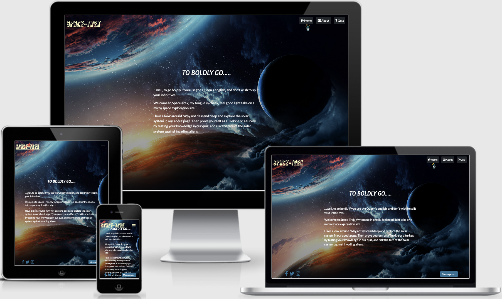
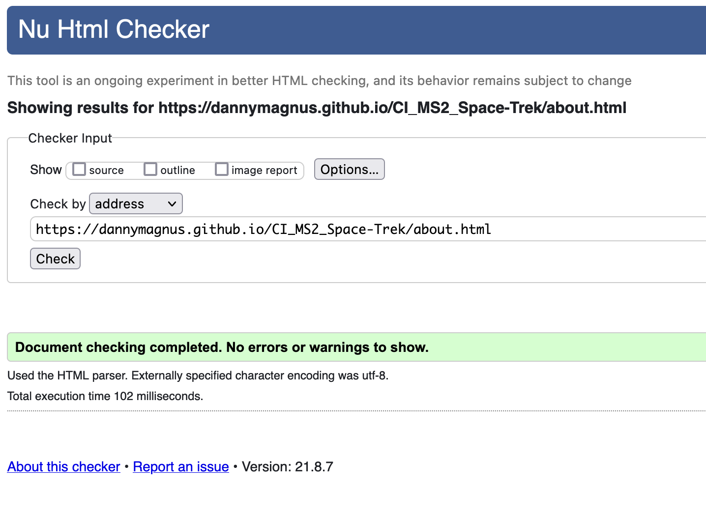
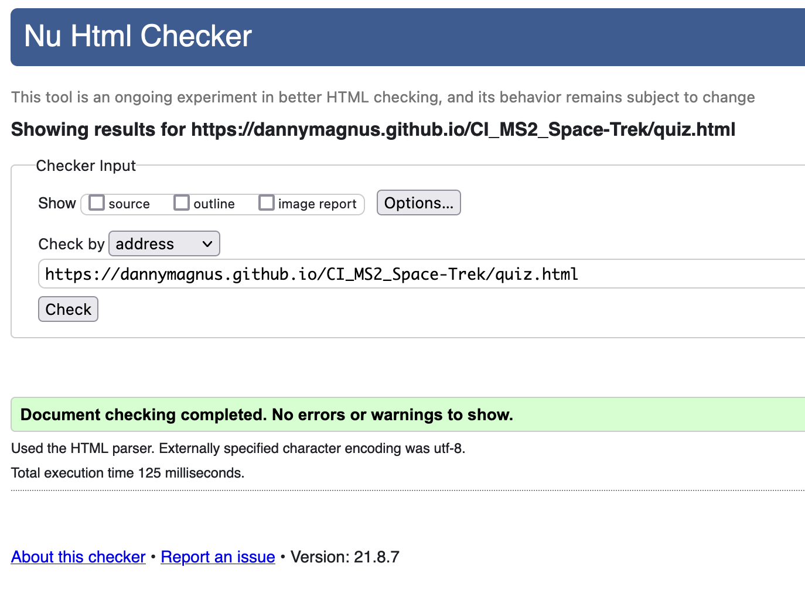
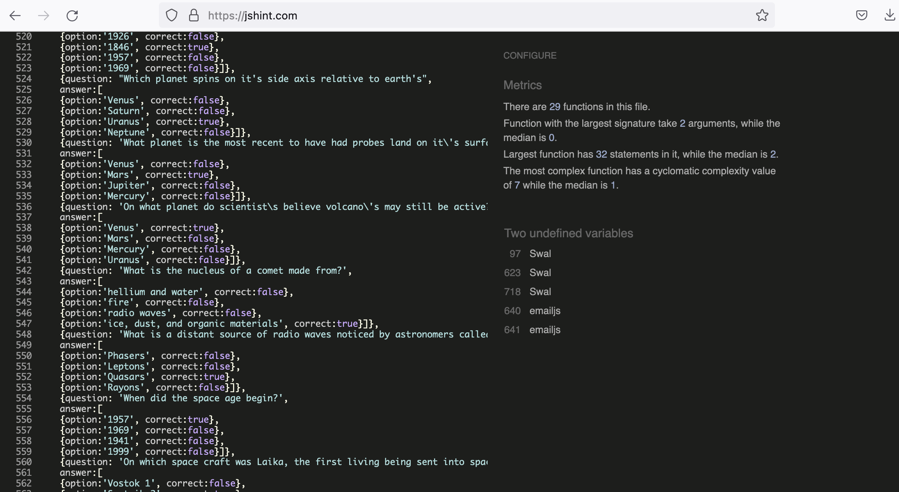
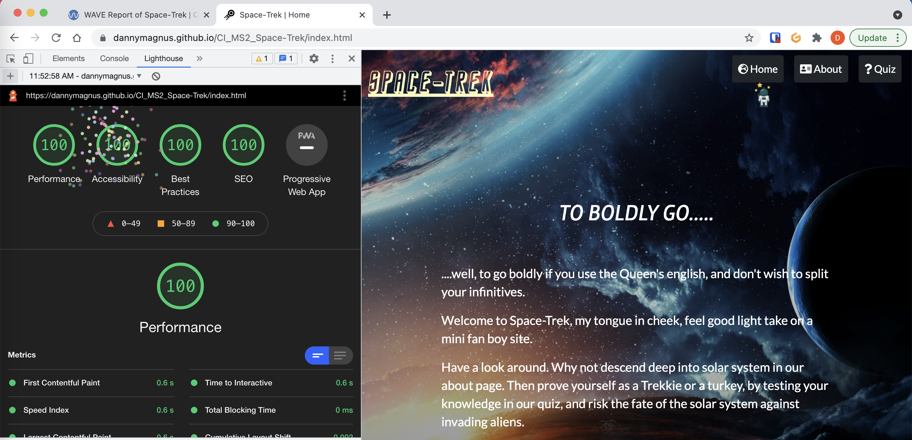
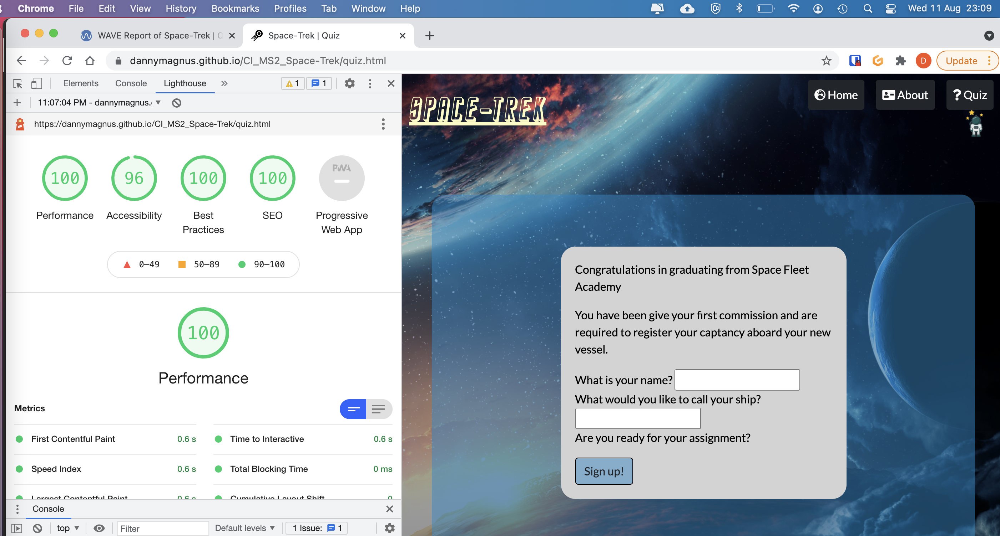

# Space-Trek
(Developer: Daniel Richards)

[View live site](https://dannymagnus.github.io/CI_MS2_Space-Trek/)

## Table of Content

1. [Project Goals](#project-goals)
    1. [User Goals](#user-goals)
    2. [Site Owner Goals](#site-owner-goals)
2. [User Experience](#user-experience)
    1. [Target Audience](#target-audience)
    2. [User Requirements and Expectations](#user-requirements-and-expectations)
    3. [User Stories](#user-stories)
3. [Scope](#scope)
4. [Design](#design)
    1. [Design Choices](#design-choices)
    2. [Colour](#colours)
    3. [Fonts](#fonts)
    4. [Structure](#structure)
    5. [Wireframes](#wireframes)
5. [Technologies Used](#technologies-used)
    1. [Languages](#languages)
    2. [Frameworks & Tools](#frameworks-&-tools)
6. [Features](#features)
7. [Testing](#validation)
    1. [HTML Validation](#HTML-validation)
    2. [CSS Validation](#CSS-validation)
    3. [JS Validation](#JS-validation)
    4. [Accessibility](#accessibility)
    5. [Performance](#performance)
    6. [Device testing](#performing-tests-on-various-devices)
    7. [Browser compatibility](#browser-compatibility)
    8. [Testing user stories](#testing-user-stories)
8. [Bugs](#Bugs)
10. [Deployment](#deployment)
11. [Credits](#credits)
12. [Acknowledgements](#acknowledgements)

## Project Goals 

### User Goals
- Explore a fun and engaging space themed microsite with quiz.
- Learn about the solar system and find out detailed planet facts.
- Test your general space knowledge.

### Site Owner Goals
- Create an fun and interactive space-adventure microsite.
- The site quiz and about page should be interactive and responsive across devices.
- The game should encourage user interaction by providing feedback to the user.

## User Experience

### Target Audience
- Space enthusiasts
- Casual gamers

### User Requirements and Expectations

- An easy navigation system with instant learning.
- Able to navigate the site quickly and easily.
- No broken links.
- Responsive and visually appealing on all devices.
- Easy way to contact site owner.
- Fun and easy to play, interactive and engaging.
- Accessibility.

### User Stories

#### First-time User 
1. As a first time user I want to be able to contact the site owner easily.
2. As a first time user, I want to be able to navigate the site quickly and easily.
3. As a first time user I want to be able to interactively increase my knowledge about space and the solar system.
4. As a first time user I want to be able to play a test my knowledge quiz.
5. As a first time user, I want be able to add a username and shipname so that my experience will be personalised.
6. As a first time user, As a user I want to be able to select an answer to the multiple choice question and get feedback on whether I am correct.
7. As a first time user, I want to be able to view my progress on the quiz.
8. As a first time user, I want feedback on whether I have successfully completed the quiz or not.
9. As a first time user, I want to be able to play the quiz again.

#### Site Owner 
10. As a site owner; I want users to be able to send us messages.
11. As a site owner; I want users to be able to find us on social media.
12. As a site owner; I want the site to be fully responsive and reactive across mobile, tablet and desktop devices.
13. As a site owner; I want all form fields validated as to not have any empty values.

## Scope

The scope of the project in it’s first release is defined by the following features: 

- Responsive navigation bar mirrored across each page which enables users to navigate the site without user the browser buttons.
- A footer across all pages with links to social media and button to message the owner. 
- Modal where you can send a message to the site owner, including your contact details.
- An about page where the user can interact to trigger dynamic information about planets in the solar system
- Embedded iframe with iteractivity about the solar system.
- For mobile devices - selectable planets on home page with summary information. 
- A fully interactive quiz page.
- 
- Favicon icon to help users identify the site.

Features to be built in future releases: 

- Larger question bank. 
- API for spotify for space exploration inspired soundtracks
- Choose your own ship from a selection of images.
- Random enemy ship images.
- Selectable difficulty levels in the quiz.

## Design

### Design Choices
My theme for the website came originally came from retro space exploration TV shows. I wanted to create a website that would offer more majesty in its background than just stars and a black backgound so chose some with brighter highlights and subject matter such as planets.  
So as to not distract from the foreground a dark overlay with gradient was placed over the image.

I wanted a site that was straightforward, with the information being concise and clear in a way that’s easy to navigate. I kept the navigation limited as to three navigation buttons with the contact as a self made modal that would appear on selection.

I wanted graphical additions to the quiz to increase visual appeal rather than just text and geometrical shapes.

I used opacity of overlaying objects to increase the premium feel of the site.

### Colour
- Text Logo and text hover - rgb(253, 252, 195)
- Text Body and other headers - white
- Button colors - rgb(45, 112, 147)
- Modals and buttons - rgba(250, 218, 221, 0.5)

These colours have been chosen as they match the image colours that will be used for background and foreground images, and are representative of the end product.  They must also be suitable for accessibility support.
The hex values from the adobe pallette below were converted to rbg as listed above. 
Correct and incorrect colors where on a scale of red to green within the quiz section, as was the color to show damage to the 'shield'.
 

### Fonts
My first heading font is a custom font StarTrekEnterpriseFuture. I chose this font because it closley resembles the Linotype fonts used in the orginal Star-Trek TV show which inspired this site. 
The second heading font is Rambla from Google Fonts.  This was chosen for the fact that is was recommended to be a space style font inkeeping with the main logo font.
 
My body font is Lato from Google Fonts. I chose this font because:
It was suggested by Google to complement the header font.

### Structure
The structure of the site is to contain four pages in order; 
- Home 
- About
- Quiz
- 404 (internal page for page not found errors)
- Contact modal - not a page in itself but an overlay available from all page footers

Each page contains the following structure

*Site logo text* - Clicking this will return the user to the landing page regardless from which page it is selected.

*Navbar* - A responsive navbar to be featured in the header of each page.  The links will be ordered from left to right in order of priority to the site and project goals and will link to each of the three pages listed above.  

*Title Banner* - small spaceman icon will sit under the currently selected page to indicate what page the user is on.

*Content Blocks* - Each page will occupy the whole of the view port with little scrolling required.  The main content will be centered on the page.

*Footer* - This will display social media links and a button to a modal contact form.

### Wireframes

Home

About

Quiz

Contact

404

## Technologies Used

### Languages
- [HTML5](https://en.wikipedia.org/wiki/HTML5)
- [CSS3](https://en.wikipedia.org/wiki/CSS)
- [JS ES6](https://en.wikipedia.org/wiki/JavaScript)

### Frameworks & Tools
1. [Git](https://git-scm.com/)
- Git was used for version control within VSCode to push the code to GitHub.
2. [GitHub](https://github.com/)
- GitHub was used as a remote repository to store project code. 
3. [GIMP](https://www.gimp.org/)
- GIMP was used to edit, crop, resize and convert files found within each of the site pages.
4. [Balsamiq](https://balsamiq.com/)
-  Balsamiq was my choice for creating wireframes for the site.
5. [Font Awesome](https://fontawesome.com/)
- Font awesome was used to generate the social media footer icons on each page.
6. [Google Fonts](https://fonts.google.com/)
- Cormorant Garamond and Playfair Display were the fonts taken from Google for headings and body respectively.
7. [Bootstrap v5.02](https://getbootstrap.com/docs/5.0/getting-started/introduction/)
- Bootstrap was used for the landing carousel, responsive nav bar, contact form modal, privacy policy and general terms and conditions modals.
8. [Am I Responsive](http://ami.responsivedesign.is/)
- The mockup image was created using Am I Responsive.
9. [transfonter](https://transfonter.org/)
- transfonter was used to convert the Logo text to fontface.
10. [Visual Studio Code (VSCode)](https://code.visualstudio.com/)
- VSCode was the IDE used to write the remainder of the project code.
11. [Mailjs](https://www.mailjs.com/)
- Mailjs was used to send mail via email from contact form.
12. [Favicon](www.favicon.io)
- Favicon was used for the browser tab icon.
13. [Jquery](https://jquery.com/)
- Jquery was used for various jquery related methods throughout the application.
14. [Solar System Scope](www.solarsystemscope.com)
- Solar System Scope was used for the iframe on the about site.
15. [SweetAlert](https://sweetalert2.github.io/)
- SweetAlert was used for the form validation alerts

## Features

The website consists of four pages and eleven features.

### Current Features

### Feature 1: Home page

The home page gives the visitor an overview of what they can expect from visiting the site, and gives an introduction to the quiz.

### Feature 2: About Page

The about page introduces the user to some fun and interesting space facts via an interactive iframe on the desktop site and a modal on a mobile site, these engage the user when they are exploring the site so there is more to the site than just a quiz. The page consists of the following features:

#### Fully interactive 3D iframe

On desktop versions the visitor sees an iframe with a fully interactive solar system model where users can interact and explore the 3D model gaining knowledge about all the planets and moon in the solar system.

#### Solar System Planet model

-	On mobile devices the visitor sees an interactive solar system model with pop out modals containing planet information.  Any planet can be selected and a modal will pop up with interesting planet facts.

**Thess screen covers the following user stories:**

*3. As a first time user I want to be able to interactively increase my knowledge about space and the solar system.*

### Feature 3: Quiz

The quiz page contains the following features:
1. The registration screen
2. The game start screen
3. The question screen
4. The victory screen
5. The defeat screen

#### Registration Screen

The game start screen consists of two sections:
- The text boxes are there to gather user details to be used in the subsequent game screens. This encourages user interaction as they are able to personalise their game.
- A button will sign the user up to the quiz with the information they have just inputted.
The form contains Javascript validation to prevent empty values from being entered.

The Registration screen covers the following user stories:

*4. As a first time user I want to be able to play a test my knowledge quiz*

*5. As a first time user, I want be able to add a username and shipname so that my experience will be personalised.*

*13. As a site owner; I want all form fields validated as to not have any empty values.*

#### Game start screen

The game start screen consists of three sections.  
- The image of the ship shows at this point and is continued throughout the quiz.
- The other section consists of the rules of the quiz, as well as a brief story set up to engage visitors.
- The button to begin the quiz.

**This screen covers the following user stories:**

*5. As a first time user, I want be able to add a username and shipname so that my experience will be personalised.*

#### Question screen

The question screen consists of 5 sections:
- The image of the visitors ship is displayed along with an enemy ship.
- The score for the player, the scoring system is displayed as a percentage. For each correct answer the enemy ship score decreases by 20%, for each incorrect answer the player’s ship score decreases by 20%. The colour starts at green for both, and will decrease down to amber then red for correct and incorrect answers.
- The question box including four answer choices. Once selected the correct answer is highlighted in green, the incorrect in red.
- The container box which starts off blue, when the correct answer is chosen it turns green, when an incorrect answer is chosen it turns red.
- The next button goes to the next question.

**This screen covers the following user stories:**

*3. As a first time user I want to be able to interactively increase my knowledge about space and the solar system.*

*6. As a first time user, As a user I want to be able to select an answer to the multiple choice question and get feedback on whether I am correct.*

*7. As a first time user, I want to be able to view my progress on the quiz.*

#### Victory screen

The victory screen consists of 4 sections:
- The player’s ship is visible and the enemy ship fades off the screen.
- The score of the players ship and the enemy ship.
- A ‘play again’ button which restarts the quiz.
- The container box which will turn green.

**This screen covers the following user stories:**

*8. As a first time user, I want feedback on whether I have successfully completed the quiz or not.*

*9. As a first time user, I want to be able to play the quiz again.*

#### Defeat screen

- The defeat screen consists of 4 sections:
- The enemy ship is visible and the player’s ship fades off the screen.
- The score of the players ship and the enemy ship.
- A ‘play again’ button which restarts the quiz.
- The container box which will turn red.

**This screen covers the following user stories:**

*8. As a first time user, I want feedback on whether I have successfully completed the quiz or not.*

*9. As a first time user, I want to be able to play the quiz again.*

### Contact page
The contact page consists of the following features:

- A modal for the visitor to send a message.
- An image of a receiver to continue the space theme across all pages.

**This screen covers the following user stories:**

*1. As a first time user I want to be able to contact the site owner easily.*

*10. As a site owner; I want users to be able to send us messages.*

### Contact received page
The contact received page shows the user their message has been received and a button which takes the visitor back to their last visited page.

**This screen covers the following user stories:**

*1. As a first time user I want to be able to contact the site owner easily.*

*10. As a site owner; I want users to be able to send us messages.*

### Error 404 page

This feature redirects the user back to any of the valid links rather than the user using browser controls.

**The 404 page highlights the following user stories**

*8. The user should be able to navigate back through the site structure in case of page not found without using the browser back button.*

## Validation

### HTML Validation
The HTML of the each page of the site was validated using [W3C Markup Validation Service](https://validator.w3.org/).  All pages returned a pass with 0 errors and 0 warnings.

Home

About

Quiz

404

### CSS Validation
The [W3C CSS Validation Service](http://jigsaw.w3.org/css-validator/validator) was used to validate the CSS of the website. 

The custom CSS file passed with 0 errors

Custom CSS file

Whole site validation returned 13 errors on third party resources and 6 errors on my custom css where variables have been used to change background and foreground colors dynamically with my js in the quiz.  Given that the implementation works without fault, that the file validation returned no errors, and following constultation with CI tutor, the css was not changed as to prevent functional failure with the site, as this would likely be issue with the validator, not the code itself.. 

Whole site

### JS Validation
The Javascript of the each page of the site was validated using [JSHint validation tool](https://jshint.com/).  All pages returned a pass with 0 errors and 0 warnings.

Home

About

Quiz

404

### Accessibility
The [WAVE WebAIM web accessibility evaluation tool](https://wave.webaim.org/ was used to ensure the website met high accessibility standards. All pages returned 0 errors.

Home

About

Quiz

404

### Performance 
[Google Lighthouse](https://developers.google.com/web/tools/lighthouse/) was used to measure the performance and speed of the website. Each page scored over 90 in all categories - performance, accessibility, best practice and SEO with results below:

Home

About

Quiz

404

### Performing tests on various devices 
The website was tested on the following devices:
- Samsung Galaxy S20 Plus
- iPhone SE 
- Iphone XS
- Macbook Pro 13.3"

In addition, the website was tested using Google Chrome Developer Tools Device Toggeling option for all available device options.

### Browser compatability
The website was tested on the following browsers:
- Google Chrome
- Mozilla Firefox
- Microsoft Egde
- Safari

#### Tests performed: 

1. Navigation toggle expands sub menu with no errors, resizing changes nav bar to burger icon.
2. Navigation link work properly and redirect to appropriate pages with no broken links.
3. Clicking the header logo directs users back to the home page on all pages.
4. All internal anchor and outbound links tested to ensure correct redirect behavior with no broken links
5. The message us... modal opens correctly on each page able to populate and closes when submitted or close selected.
6. The modal or contact form will not submit umless the user has sumbitted a name and email, phone remains optional.
7. On contact form submission, success feedback message is given.
8. Images and text collapse into a column view when view on mobile devices.
9. About section switches from iframe to planet selection on small devices
10. All pages are responsive and no text or image cut off in mobile views.
11. Designated items and text do not show in mobile layout.
12. All copy is clear and legible.
13. Flexbox and direction and breakpoints checked on browser resizing.

#### Results: 

All functional tests were passed.
Point to note:  On IOS devices.  The custom font StarTrekEnterpriseFuture did not display correctly.  This remains as custom fonts on IOS in not in scope for this project.

### Testing user stories

1. As a user I want to be able to contact the site owner easily

| **Feature** | **Action** | **Expected Result** | **Actual Result** |
|-------------|------------|---------------------|-------------------|
| Find message us button in bottom right page       |      Click button, fill form, click submit       | Modal loads over top of current page, contact form presents, acknowledgement on submit, page returns | Works as expected |
| Find message us button in bottom right page  |   Click button, fill form AND/OR click close (x) button   | Navigates to home page in same browser tab | Works as expected |

Screenshots

2. As a first time user I want to be able to navigate the site quickly and easily

| **Feature** | **Action** | **Expected Result** | **Actual Result** |
|-------------|------------|---------------------|-------------------|
| Find navigation links in page header  |   Click on link   | Opens respective site page | Works as expected |

Screenshots

3. As a first time user I want to be able to interactively increase my knowledge about space and the solar system.

| **Feature** | **Action** | **Expected Result** | **Actual Result** |
|-------------|------------|---------------------|-------------------|
| Find link to About page in nav bar       |      Click link and find solar interactive iframe, click to launch      | iframe should launch interactive content (desktop only) | Works as expected |
| Find link to About page in nav bar       |      Click link and find solar interactive planet selection, click a planet to launch      | modal should launch interactive content (desktop only) | Works as expected |

Screenshots

4. As a first time user I want to be able to play a test my knowledge quiz.

| **Feature** | **Action** | **Expected Result** | **Actual Result** |
|-------------|------------|---------------------|-------------------|
| Find link to quiz page in nav bar       |      Click link  |  Quiz page appears | Works as expected |

Screenshots

5. As a first time user, I want be able to add a username and shipname so that my experience will be personalised.

| **Feature** | **Action** | **Expected Result** | **Actual Result** |
|-------------|------------|---------------------|-------------------|
| Find link to quiz page in nav bar       |      Click link and enter details and click begin  |Welcome message is displayed with user details| Works as expected |

Screenshots

6. As a first time user, As a user I want to be able to select an answer to the multiple choice question and get feedback on whether I am correct.

| **Feature** | **Action** | **Expected Result** | **Actual Result** |
|-------------|------------|---------------------|-------------------|
 Quiz page      |      Begin quiz and select answer     |User is presented with a question and multiple options which give feeback on true or false | Works as expected |

Screenshots

7. As a first time user; As a first time user, I want to be able to view my progress on the quiz.

| **Feature** | **Action** | **Expected Result** | **Actual Result** |
|-------------|------------|---------------------|-------------------|
| Site quiz scores area      |      Answer questions and progress through quiz     |'Shield' percentage will update depending on number of answers correct / incorrect | Works as expected |

Screenshots

8. As a first time user, I want feedback on whether I have successfully completed the quiz or not.

| **Feature** | **Action** | **Expected Result** | **Actual Result** |
|-------------|------------|---------------------|-------------------|
| Quiz page       |      User shields OR ememy shields = 0  |  Quiz ends with success or defeat message  |  Works as expected  |

Screenshots

9. As a first time user, I want to be able to play the quiz again.

| **Feature** | **Action** | **Expected Result** | **Actual Result** |
|-------------|------------|---------------------|-------------------|
| Quiz restart      |      Complete quiz and click play again     | Quiz restarts with out user needing to re-register |  Works as expected |

Screenshots

10. As a site owner; I want users to be able to send us messages.

| **Feature** | **Action** | **Expected Result** | **Actual Result** |
|-------------|------------|---------------------|-------------------|
| Find message us button in bottom right page       |      Click button, fill form, click submit       | Modal loads over top of current page, contact form presents, acknowledgement on submit, page returns | Works as expected |
| Find message us button in bottom right page  |   Click button, fill form AND/OR click close (x) button   | Navigates to home page in same browser tab | Works as expected |

Screenshots

11. As a site owner; I want users to be able to find us on social media.

| **Feature** | **Action** | **Expected Result** | **Actual Result** |
|-------------|------------|---------------------|-------------------|
| Find social media icon links in page footer      |      Click link    | Social media page opens in separate tab | Works as expected |

Screenshots

12. As a site owner; I want the site to be fully responsive and reactive across mobile, tablet and desktop devices.

| **Feature** | **Action** | **Expected Result** | **Actual Result** |
|-------------|------------|---------------------|-------------------|
| Whole site      |      Test above user stories across mobile, tablet and desktop devices | Site should be fully responsive and work without major errors| Works as expected |

13. As a site owner; I want all form fields to be validated to not have any empty values.

| **Feature** | **Action** | **Expected Result** | **Actual Result** |
|-------------|------------|---------------------|-------------------|
|  Message us modal form    |      Attempt to submit with any field as an empty value | Alert window shown prompting user to populate all fields | Works as expected |  Ship registration form  |  Attempt to submit with any field as an empty value | Alert window shown prompting user to populate all fields |  Works as expected |

Screenshots

## Bugs

| **Bug** | **Fix** |
| ----------- | ----------- |
| Modal close button greyed out and unresponsive | Removed 'disabled' attribute |
| Unable to set overlaying div on solar system background in about small devices | Use individual img instead |
| Message us modal broke quiz display once started | Hide message us button once quiz starts | Custom font does not display on IOS devices |
| No fix at this time | Setting body as vh caused footer overlap as position absolute  |  Update absolute to not apply to quiz page |
Clicking the answer buttons after the first selection depletes shields for each press | Removed event listener with for loop |
In the case listed above on sheilds reaching 0 both next and play again are listed |  Removed event listener with for loop |
## Deployment

### GitHub Pages

This website has been deployed using GitHub pages. To do the same...

1. Log into your GitHub account and find the [repository](https://github.com/dannymagnus/CI_MS2_Space-Trek). 
2. Click on 'Settings' in the repository. 
3. Click 'Pages' in the left-hand menu once you're in Settings. 
4. Click 'Source'.
5. Click the dropdown menu which says 'None', then select 'Master Branch'.
6. Wait for page to refresh automatically. 
7. Under GitHub pages you can now find a link to the published live website. 

### Forking the GitHub Repository 

By forking this GitHub repository you are making a copy of the original to view or make changes without affecting the original. You can do this by following these steps...

1. Log into your GitHub account and find the [repository](https://github.com/dannymagnus/CI_MS2_Space-Trek).
2. Click 'Fork' (last button on the top right of the repository page).
3. You will then have a copy of the repository in your own GitHub account. 

### Making a Local Clone

1. Log into your GitHub account and find the [repository](https://github.com/dannymagnus/CI_MS2_Space-Trek).
2. Click on the 'Code' button (next to 'Add file'). 
3. To clone the repository using HTTPS, under clone with HTTPS, copy the link.
4. Then open Git Bash.
5. Change the current working directory to where you want the cloned directory to be made.
6. In your IDE's terminal type 'git clone' followed by the URL you copied.
7. Press Enter. 
8. Your local clone will now be made.

## Credits

*All credit also included in the page files.*

### Code

- **WebDev Simplified** - for [Flexbox](https://www.youtube.com/watch?v=fYq5PXgSsbE&t=363s) and [Grid](https://www.youtube.com/watch?v=9zBsdzdE4sM) learning about quiz concepts.
- **CSS Tricks** - for [Scaleable Divs](https://css-tricks.com/aspect-ratio-boxes/) for scaleable divs
- **W3C Schools** - for [jquery](https://jquery.com/) FadeIn and FadeOut methods.
- **Google Fonts** - for [Importing Fonts](https://fonts.google.com/)
- **Bootstrap** - for [Modals](https://getbootstrap.com/docs/5.0/getting-started/introduction/). Bootstrap was used for the responsive nav bar, some button styles and modals in the about page for planets.
- **Font Awesome** - for [Social Media Icons](https://fontawesome.com/)
- **Favicon** - for [Browser icon](www.favicon.io)
- **Solar System Scope** - for [iframe](https://www.solarsystemscope.com/)
- **Font Space** - for [Star-Trek Theme Font](https://www.fontspace.com/category/star-trek)
- **Transfonter** - for [Font conversion](https://transfonter.org/)

### Media

Media from the following artists was used throughout the site.

- [Adobe Stock Images](www.stock.adobe.com)
- [NASA](https://solarsystem.nasa.gov/planets/)
- [Solar System Scope](https://www.solarsystemscope.com/)
- [envatotutsplus](https://design.tutsplus.com/tutorials/create-a-star-trek-style-communicator-in-photoshop--psd-13545)

### Acknowledgements: 

- To my wife Rebecca Richards for her testing, support, feedback, permissions for content and images on this project. 
- To my mentor Mo Shami for his invaluable guidance and direction.
- To the Code Institute slack community of students.
- To the Code Institute Tutors